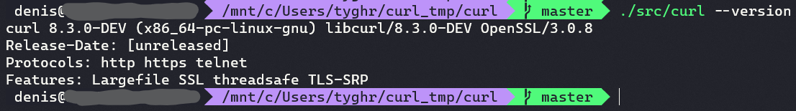

Сборка в UNIX

Цель задания
- В процессе выполнения ДЗ вы получите опыт сборки программ для UNIX-подобных ОС

Описание/Пошаговая инструкция выполнения домашнего задания:
- Необходимо скачать curl последней версии и собрать его в любой UNIX-подобной ОС с поддержкой лишь трёх протоколов: HTTP, HTTPS и TELNET

Требования:
- Работа осуществляется в UNIX-подобной ОС (любой дистрибутив Linux, любая BSD-система, MacOS).
- Скачан и распакован исходный код curl.
- Сборка сконфигурирована с поддержкой лишь трёх протоколов HTTP, HTTPS и TELNET.
- Осуществлена сборка (установку в систему осуществлять не требуется и не рекомендуется).
- Собранный curl запущен с ключом --version для подтверждения корректности сборки.

Вспомогательные материалы
- [how to install curl and libcurl](https://curl.se/docs/install.html#unix)
- [Build curl](https://everything.curl.dev/build#on-linux-and-unix-like-systems)

---
## Решение:
```shell
git clone https://github.com/curl/curl.git
cd curl

# https://github.com/curl/curl/blob/master/GIT-INFO
autoreconf -fi

# apt build-dep curl
apt install libssl-dev

./configure --with-openssl \
    --disable-headers-api \
    --disable-threaded-resolver \
    --disable-ipv6 \
    --disable-libcurl-option \
    --without-zlib \
    --disable-alt-svc \
    --disable-manual \
    --disable-verbose \
    --disable-hsts \
    --disable-progress-meter \
    --disable-proxy \
    --disable-unix-sockets \
    --disable-dict \
    --disable-file \
    --disable-gopher \
    --disable-smb \
    --disable-ftp \
    --disable-imap \
    --disable-mqtt \
    --disable-pop3 \
    --disable-rtsp \
    --disable-smtp \
    --disable-tftp \
    --disable-ntlm

make

./src/curl --version
```

